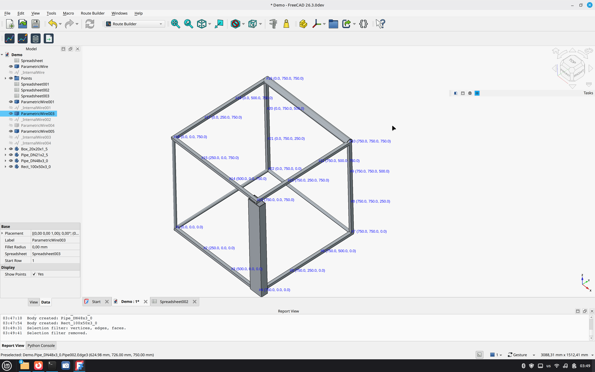
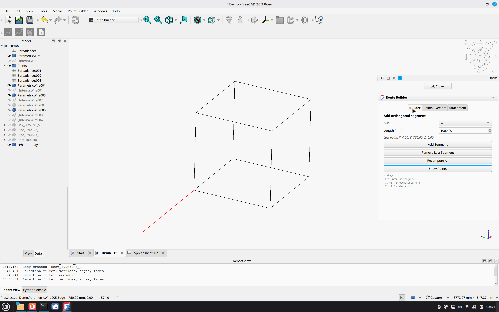
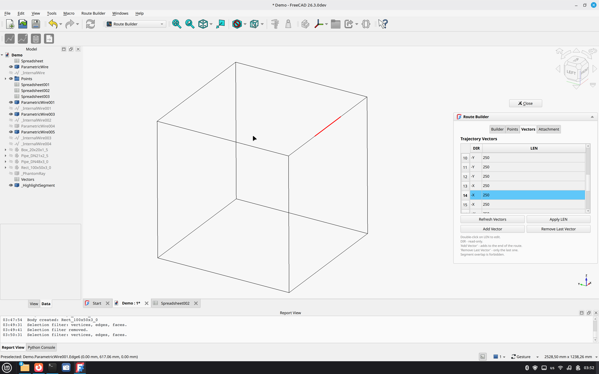
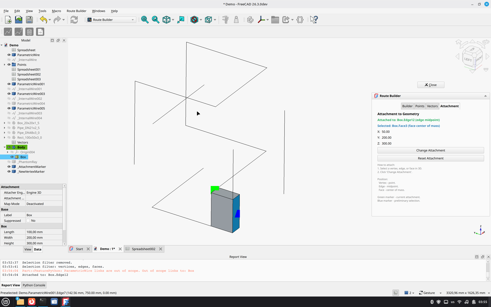
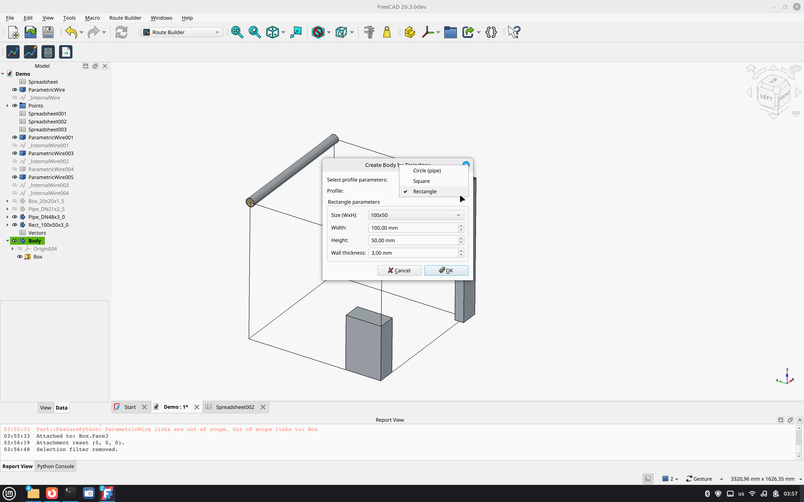
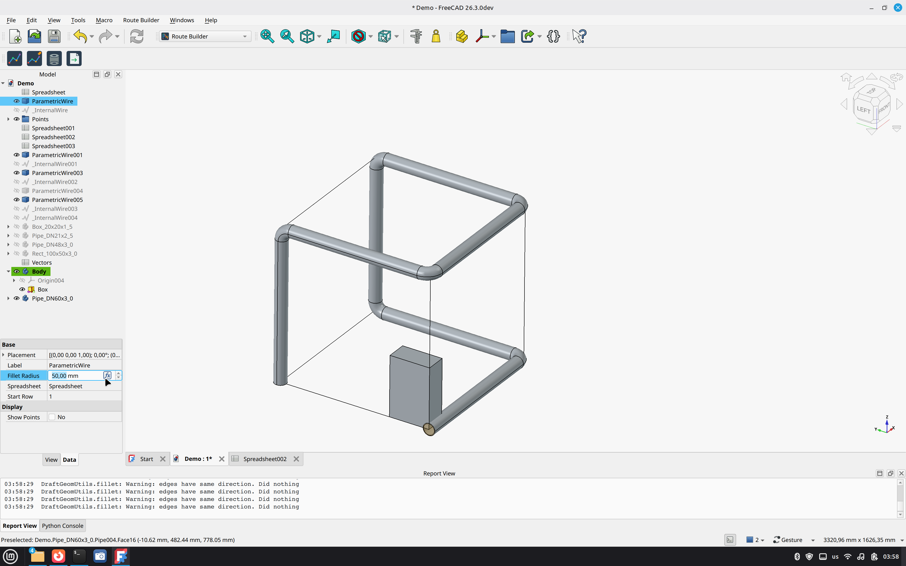

# FreeCAD-RouteBuilder

**3D orthogonal route builder for FreeCAD**

A FreeCAD workbench for building parametric 3D routes (pipes, cables, ducts) with automatic generation of solid bodies.



## Features

- **Parametric route** — built from coordinates in a Spreadsheet
- **Builder panel** — add segments by axis (+X, -X, +Y, -Y, +Z, -Z) and length
- **Points table** — view and edit trajectory points
- **Vectors table** — cross-linked with coordinates; edit length and coordinates recalculate automatically
- **Attachment** — attach route start to existing geometry (vertex, edge, or face)
- **Overlap check** — prevents segment self-intersection
- **Body generation** — pipe (circle), box (square), or rectangle profile along the route
- **STEP export** — for use in other CAD systems

## Screenshots

### Builder tab
Adding orthogonal segments with a color-coded phantom.



### Vectors tab
Editing segment lengths and highlighting segments in 3D.



### Attachment tab
Attaching the route to existing geometry (vertices, edges, faces).



### Create Body by Trajectory
Generating a body along the route with a chosen profile.



### Result — pipe with fillets
Completed pipe body with rounded corners.



## Installation

### Manual (recommended for now)

Clone this repository into your FreeCAD `Mod` directory:

**Linux:**
```bash
cd ~/.local/share/FreeCAD/Mod/
git clone https://github.com/vibecader/FreeCAD-RouteBuilder.git
```

**Windows:**
```bash
cd %APPDATA%/FreeCAD/Mod/
git clone https://github.com/vibecader/FreeCAD-RouteBuilder.git
```

**macOS:**
```bash
cd ~/Library/Application\ Support/FreeCAD/Mod/
git clone https://github.com/vibecader/FreeCAD-RouteBuilder.git
```

Restart FreeCAD. Switch to the **Route Builder** workbench.

### Via Addon Manager

*Not yet available. The workbench will be submitted to the FreeCAD Addon Manager after community feedback.*

## Quick Start

1. Create a **Spreadsheet** (workbench `Spreadsheet`) and fill columns A, B, C with X, Y, Z coordinates.
2. Switch to the **Route Builder** workbench.
3. Click **Create Route** → select the spreadsheet.
4. In the **Builder** tab, choose axis and length, then click **Add Segment** (or press `Ctrl+Enter`).
5. Switch to the **Vectors** tab to edit segment lengths if needed.
6. Click **Create Body by Trajectory** and select the profile (circle, square, or rectangle).
7. Export the result with **Export to STEP**.

## Documentation

Full user manual (English + Russian): [docs/manual.html](docs/index.html)

## Hotkeys

| Keys | Action |
|---|---|
| `Ctrl+Enter` | Add segment |
| `Ctrl+Z` | Remove last segment |
| `Ctrl+1..6` | Select axis (+X, -X, +Y, -Y, +Z, -Z) |

## Requirements

- **FreeCAD** 1.0 or newer
- **PySide6** (bundled with FreeCAD)

## Roadmap

See [ROADMAP.md](ROADMAP.md) for the full list of planned features.

**Short version:**

- **Import from CSV/Excel** — load coordinates from a file
- **Trajectory cloning** — duplicate a route
- **User presets** — save and reuse profile sets
- **Additional export formats** — STL, IGES, OBJ
- **Toggleable overlap check** — disable self-intersection protection

*Contributions are welcome!*

## License

- Code: [LGPL-2.1-or-later](Lic/LICENSE.txt)
- Assets (icons): [CC-BY-SA-4.0](Lic/LICENSE-Assets.txt)

## Author

**VibeCADer** — [GitHub](https://github.com/vibecader)

---

*Found a bug or have a suggestion? Open an issue on [GitHub](https://github.com/vibecader/FreeCAD-RouteBuilder/issues).*
